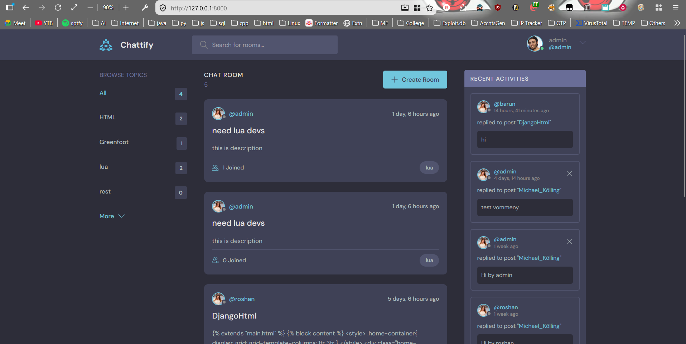
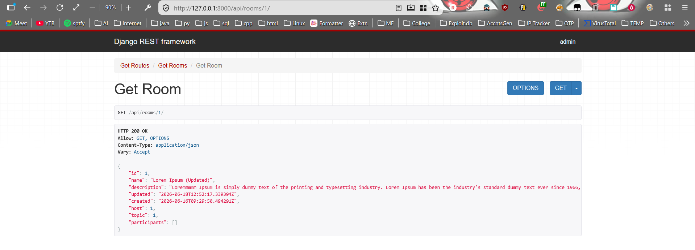

# Chattify: Connect with the world





## About

Chattify is a room-based discussion and messaging platform built with Django. Users can create chat rooms around different topics, participate in conversations, manage their own content, and discover discussions through search and activity feeds. The project also includes REST API endpoints for accessing application data.

## Features

- User Registration & Authentication
- User Profiles
- CURD
- Topic-Based Discussions
- Room Messaging System
- Participant Tracking
- Search Rooms by Topic, Name, or Description
- Recent Activity Feed
- REST API with Django REST Framework

## Tech Stack

- Django
- Django REST Framework
  
## API Endpoints

```http
GET /api
GET /api/rooms
GET /api/rooms/<id>
